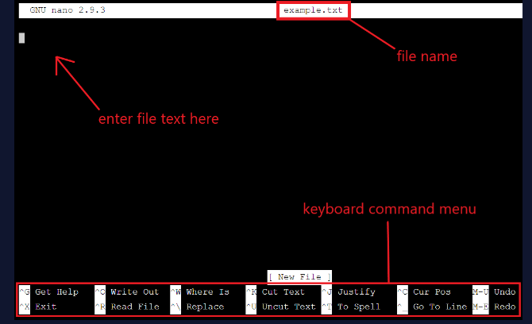
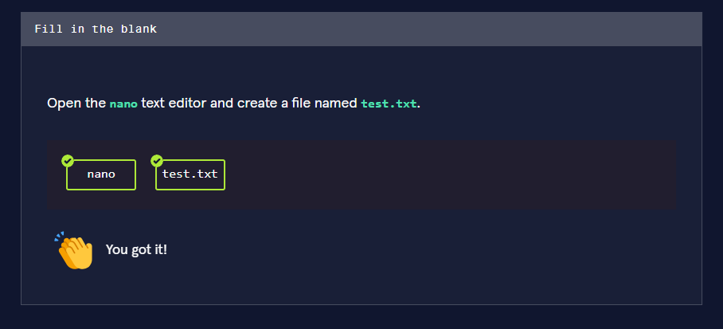
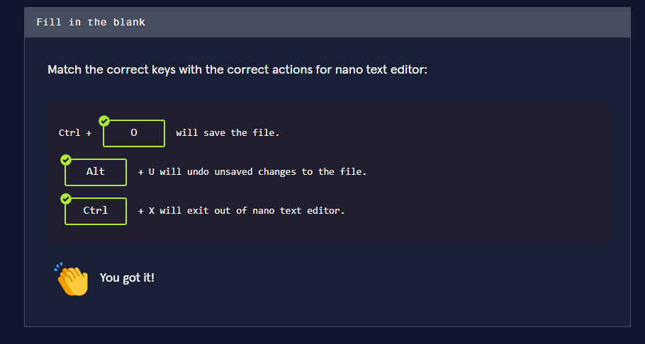
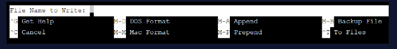
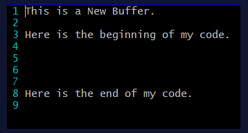

Lesson link:

https://www.codecademy.com/courses/learn-raspberry-pi-command-line/articles/command-line-nano-text-editor

### Command Line: nano Text Editor

## Create files from the command line!

**nano Text Editor**
nano is a command-line text editor used to create or edit files. It works the same way as a desktop text editor like TextEdit or Notepad, except that it is accessible from the command line and only accepts keyboard input.

```
nano example.txt

```
The command above will open the nano text editor where the text file example.txt can be edited. If example.txt didn’t previously exist then the nano command will open a blank file named example.txt such as:




Notice the file name, where to enter the file text, and the keyboard command menu are all highlighted in red. The keyboard command menu may vary depending on the system being used.

In the keyboard command menu, the ^ symbol stands for the Ctrl key, M stands for the Alt key, and the keyboard letters are not case sensitive (you do not have to capitalize the letters).

Here are a few important keyboard commands to know:

- Ctrl + O saves a file. O stands for output.
- Ctrl + G opens a help menu.
- Ctrl + X exits the nano program. X stands for exit.
- Alt + U will undo your last action.
- Alt + E will redo your last undo action.
For Mac users, the Option key is the Alt key equivalent.




>



touch Command
Another useful command used to create files in the command line is the touch command. The touch command takes in a file name as an argument and then creates an empty file with that name in the current working directory. Unlike nano, the touch command is not a text editor, and files can only be created and not edited.
```
$ touch keyboard.txt
```
Here we used touch to create a new file named keyboard.txt.

Open nano With No File
nano can be opened without referencing a specific file to edit.
```
nano
```
This command will open the nano text editor, however, it will say “New Buffer” at the top of the editor instead of stating the file name. We can enter text and edit the “New Buffer” just like a file. Then when we save it (Ctrl+O), it will say “File Name to Write: “ at the bottom, and this is when we create the file name.



### Navigating in nano
There are many navigation key combinations in the nano text editor to help the user better access the nano file. We will only discuss some of the keys but know that a complete list of all the navigation shortkeys can be found here.

Basic Navigation Key Combinations
To move the cursor:
To the top of the file: Alt + \

To the bottom of the file: Alt + /

One word forward: Ctrl + →

One word backward: Ctrl + ←

To the previous block: Ctrl + ↑

To the next block Ctrl + ↓

To the start of the line: Ctrl + A

To the end of the line: Ctrl + E

The keys are not case-sensitive.

### Navigate by Line or Column Number
A great way to navigate through a file is by line number. To enable the line numbers, enter the keys Alt + N. Important: Depending on the computer, when using an internet browser, these shortkeys may open a new window. Therefore, you must use these keys in a real command line.



To move the cursor to a specific line in the file, enter the keys Alt + G. The following text will appear at the bottom of the nano text editor (above the keyboard command menu).

This is a screenshot of the text that says, "Enter line number, column number: 8".

The text is prompting us to enter the line number and column number (separated by a comma). However, we have only entered the line number 8. After pressing enter, the cursor moved to line 8:

This is a screenshot of the cursor at the beginning of line 8 in a `nano` file.

### Search the nano File
To search for a text pattern in a nano file, enter the keys Ctrl + W. This will start a forward search (from top to bottom) that will begin where the cursor is located. Important: Depending on the computer, when using an internet browser, these shortkeys may exit out of the current window. Therefore, you must use these keys in a real command line.

After pressing Ctrl + W we entered the text pattern code in the search bar.


